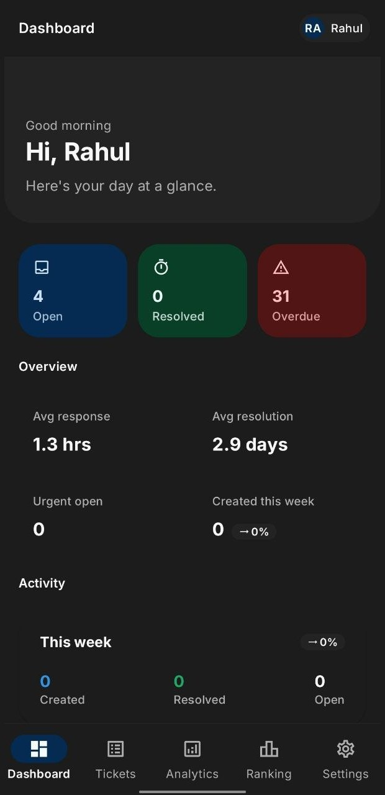
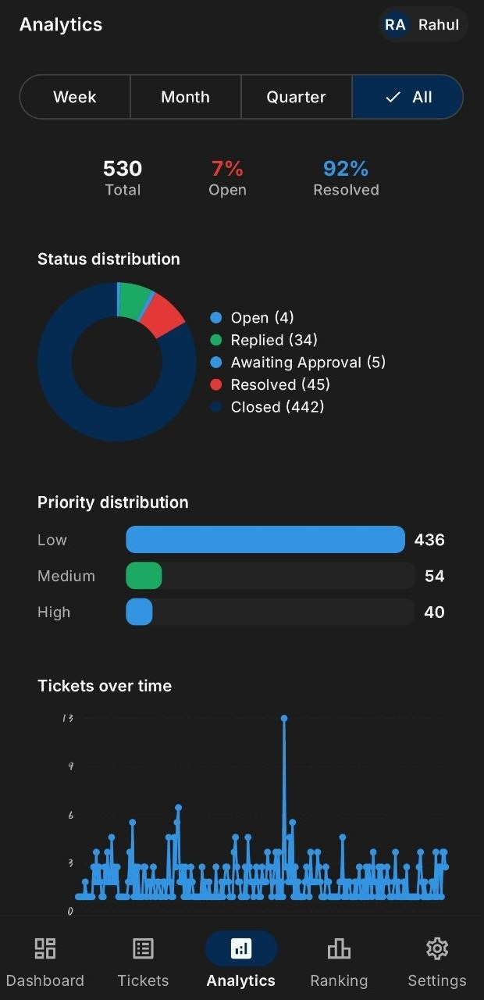
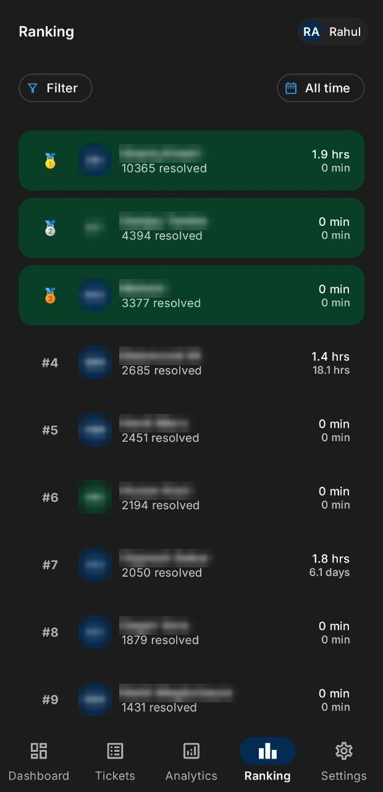
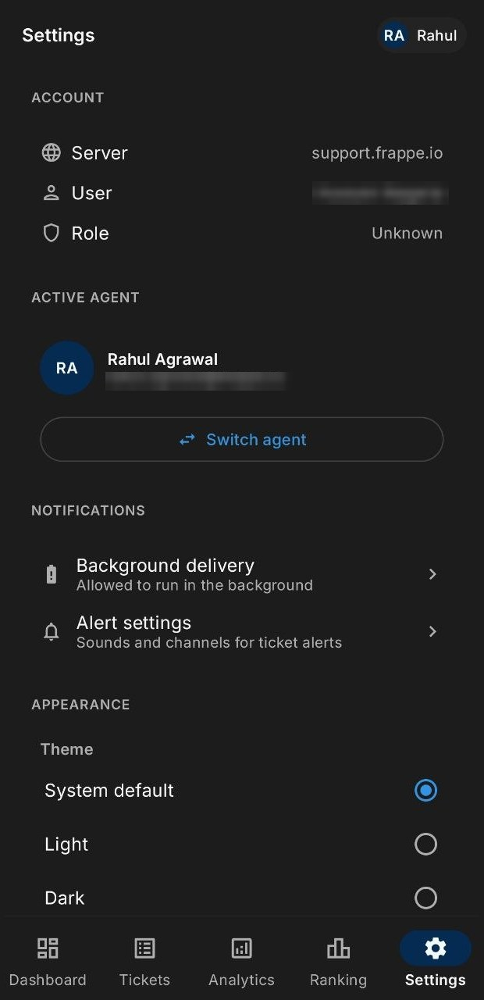

# Helpdesk Mobile

An Android app for [Frappe Helpdesk](https://github.com/frappe/helpdesk). Read your
tickets and see how the queue is doing, from your phone.

Replying, commenting, and changing status or priority need an agent to write as,
which the app sets up when you pick one in Settings. Until then it stays read
only. See [Acting as an agent](#acting-as-an-agent).

  
  
  
  

Dashboard, analytics, agent ranking, and settings. Other people's names are
masked in these shots; the app shows them as they are.

## What you need

A Frappe Helpdesk site and an API key and secret from a user on it.

The account has to be a **System User**. Helpdesk blocks most API paths for
website users, so an agent account with a plain portal login will fail at sign in
with "Access not allowed for this URL". You can check the user type on the User
record in desk.

To generate the key and secret, open your User record in desk, then API Access,
then Generate Keys. The secret is shown once, so copy it before closing the
dialog.

## Install

Download the APK from the [latest release](https://github.com/kaulith/helpdesk-mobile/releases/latest)
and open it on your phone. Android will ask you to allow installs from your
browser or file manager the first time.

Sideloaded apps do not update themselves. Two options:

- [Obtainium](https://github.com/ImranR98/Obtainium): add this repo's URL once and
  it will tell you when a new release is out.
- The app also checks the releases page on launch and shows a banner when a newer
  version exists. Tapping it opens the release page; you still install by hand.

Every release is signed with the same key, so a new version installs over the old
one and keeps your data.

## Signing in

Enter your site URL, API key, and API secret. They are stored in encrypted
preferences on the device and are not sent anywhere except your site.

## Acting as an agent

Reads always run as the account you signed in with. Writes, meaning replies,
comments, status and priority changes, are attributed to the agent you pick in
Settings.

Picking yourself works right away, using the key you signed in with.

Picking someone else needs an API key for them, and Frappe only issues one by
replacing that agent's current secret. So the app asks first. Choose "Issue key"
if you are sure nothing else uses that agent's key, or "Read only" to browse
their tickets and get their notifications without touching it. Minting a key
needs the System Manager role.

## Notifications

Push notifications come from [helpdesk_push](https://github.com/kaulith/helpdesk-push),
a small Frappe app that watches tickets and sends through Firebase. Without it the
app still works; you just refresh by hand.

## Building it yourself

1. Copy `local.properties.sample` to `local.properties` and set `sdk.dir`.
2. Create a Firebase project, add an Android app for your package name, and put
   the downloaded `google-services.json` in `app/`. The file is untracked;
   `app/google-services.json.sample` shows the shape.
3. `./gradlew assembleDebug`.

For a signed release build, fill in the `release.*` keys in `local.properties`
and run `./gradlew assembleRelease`. Tagging a commit `v1.2.3` builds and
publishes the APK through GitHub Actions, and the version number comes from the
tag.

Nothing secret is committed. Credentials are entered at sign in, and the signing
key and Firebase config stay out of the repo.

## License

MIT. See [LICENSE](LICENSE).
